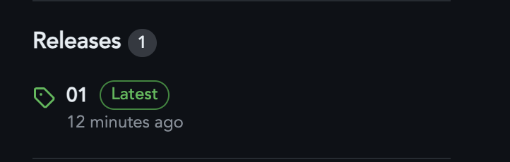
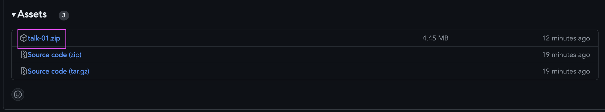

# Webtalks

A collection of Tech talk on topics related to web.

## Overview

The repository contains a list of tech talks on various topics related to web development. The talks are categorized based on the topics they cover.

The slides for each talk is created using [slidev](https://sli.dev/) and is available in the respective folder.

## How to view the slides

To view the exported slides, simply

1. Navigate to the release section of the repository.
2. Download the slides for the talk you are interested in.
3. Use static server to view the slides. For example, you can use [serve](https://www.npmjs.com/package/serve) or something similar to view the slides locally by running the `serve -s <unzipped_folder>` command in the terminal.

Refer these below screenshots to locate the release tab and the zip file, 

